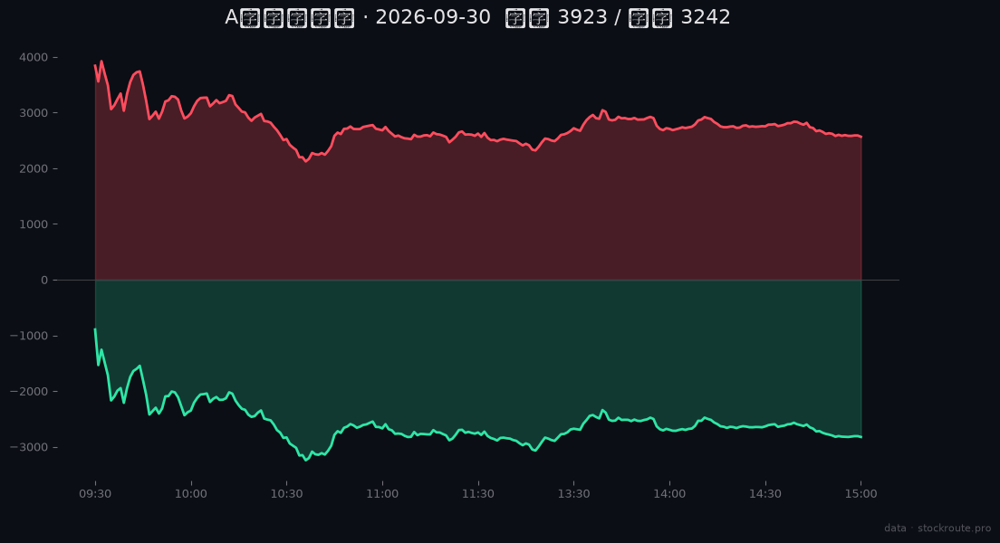
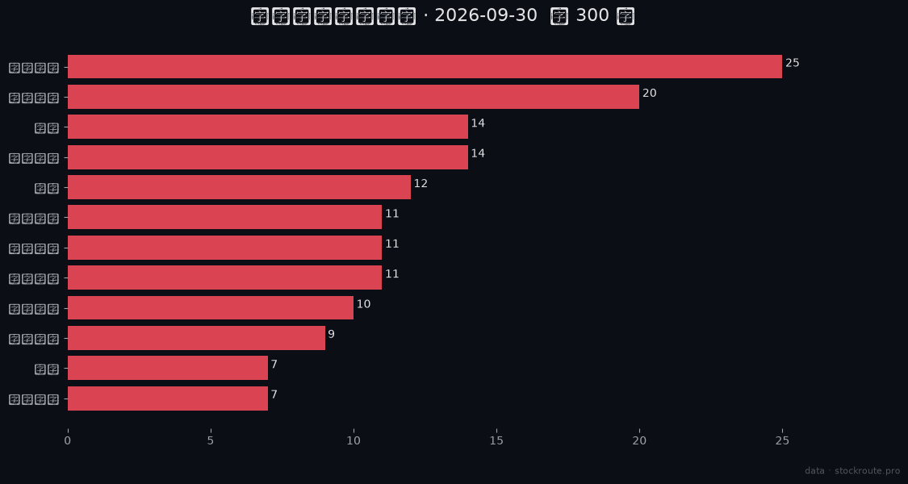

# StockRoute Terminal · A股市场驾驶舱

> 开源的 A股市场可视化终端 —— 赚钱效应一目了然:板块热度 · 连板天梯 · 游资动向 · 个股一票看懂。




## 这是什么

面向**想靠股票赚钱的普通用户**的市场终端:打开 3 秒看到"今天钱往哪冲、谁是龙头、这票为什么涨"。

| 页面 | 内容 |
|---|---|
| 今日赚钱效应 | 温度计(红绿盘比)+ 涨停统计 + 连板龙头 + 人气榜 + 异动归因流 |
| 市场心跳 | 全天 241 分钟 涨跌家数+成交额 **动画回放**(免费档可用) |

## 快速开始

```bash
pnpm install && pnpm --dir web dev
# 浏览器打开 http://localhost:5173
```

- **游客模式**:核心页面直接可玩(服务端 demo 数据)
- **解锁更多**:右上角设置粘贴 [StockRoute token](https://github.com/Stock-Route/stockroute-sdk)([免费注册](https://m-stock.600044.xyz)即得)——自选实时、3 年 K线、更多数据集
- **部署**:CF Pages,`functions/` 目录即代理层,配 `DEMO_TOKEN` secret 即可上线

## 数据

全部数据来自 [StockRoute API](https://github.com/Stock-Route/stockroute-sdk):免费档 60+ 数据集;
契约稳定(信封 error 码 + field_map 字段映射)。开发期每日契约冒烟 CI 防漂移(见 docs)。

## License

MIT
